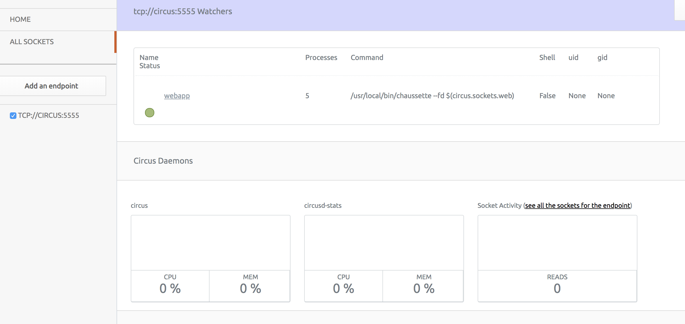
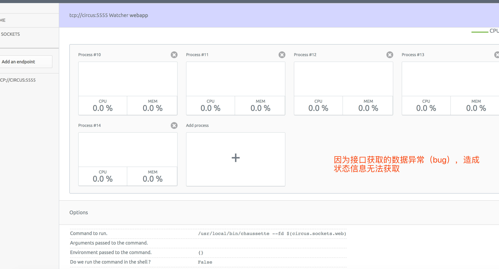

# running circus with separate docker image

## how to running

* docker image

circus: `dalongrong/circus:3.7-slim-stretch` with python3.7

circus-web: `dalongrong/circusd-web:2.7-slim-stretch` with python2.7

* start

```code
docker-compose up -d
```

* view web console

```code
open http://localhost:8080
```

* web console zeromq config

```code
connect address set tcp://circus:5555
```

## some images





## some notes

* circus web stats endpiont address err

because some bug with circus web console for fetch address of stats endpoint

so process stats maybe not works with separate docker instance

* security

this  kink of way is not security for production the better way is use ssh tunneling